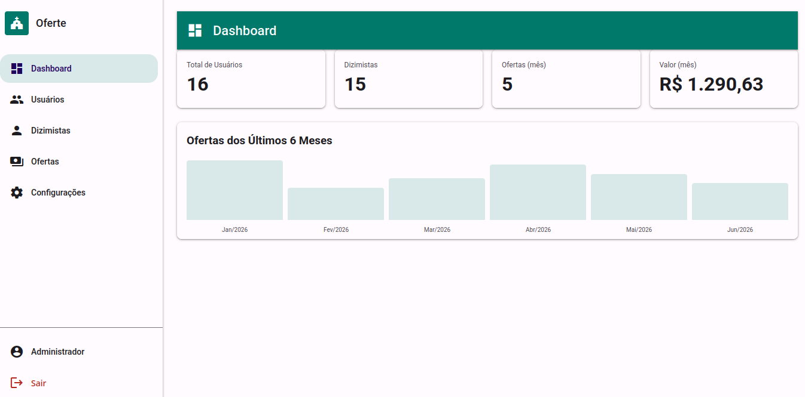
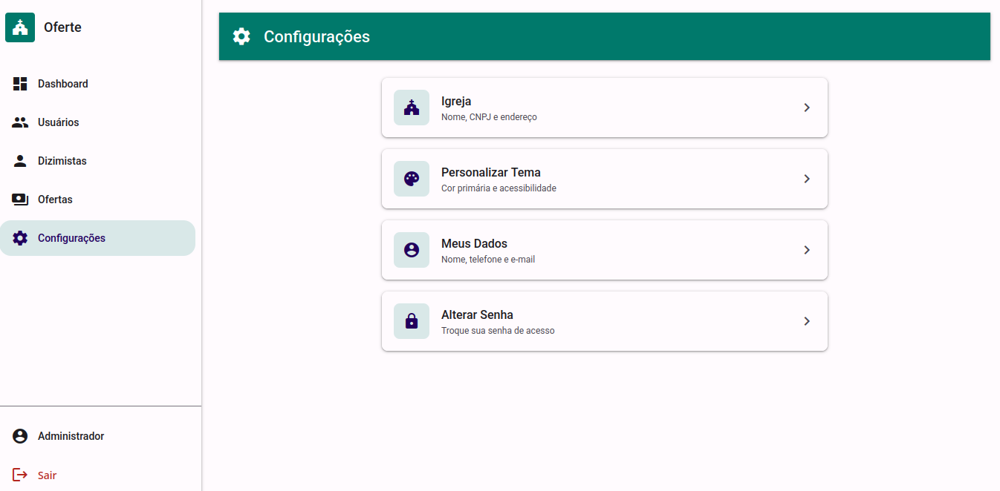
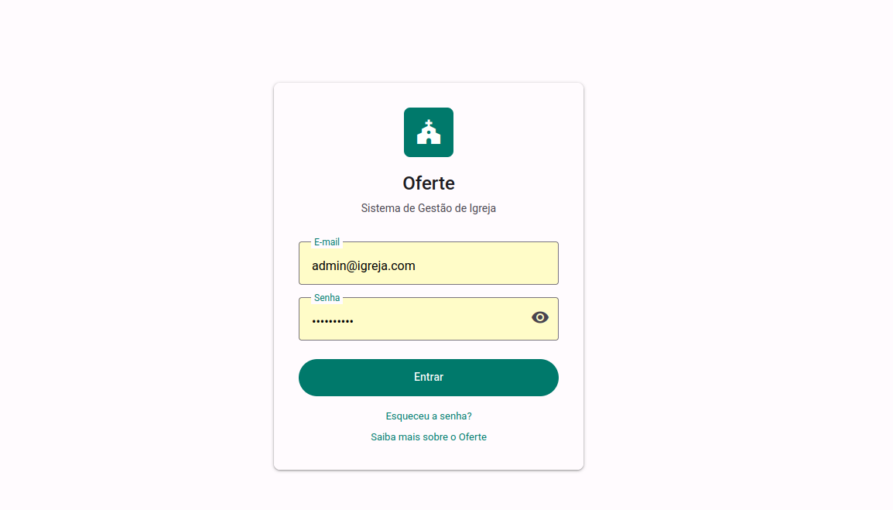

# Oferte — Sistema de Gestão de Ofertas e Dízimos

---

**UNIVERSIDADE ESTADUAL DO CEARÁ — UECE**

**DISCIPLINA:** INTRODUÇÃO AOS SISTEMAS DE INFORMAÇÕES

**PROFESSOR:** JONAS LIMA CAVALCANTE

**Equipe:**
- ANTONIO VALDIZ MARTINS TEIXEIRA
- CARLA BEATRIZ DA SILVA SOUZA
- PEDRO JEFFERSON SEVERINO DE SOUZA
- SILVIO DOS SANTOS SOUZA
- YAGO LOURENCO DA SILVA

---

## O que é o Oferte?

O **Oferte** é uma plataforma moderna e intuitiva desenvolvida para informatizar o processo de registro, acompanhamento e gestão de ofertas e dízimos em igrejas e instituições religiosas. Ele substitui planilhas, cadernos físicos e controles manuais por um sistema digital robusto, acessível e seguro.

Com o Oferte, líderes religiosos, tesoureiros e equipes administrativas podem cadastrar membros, registrar ofertas e dízimos de forma rápida, acompanhar o histórico de contribuições e gerar relatórios consolidados — tudo em poucos cliques.

Além de organizar a gestão financeira da instituição, o sistema promove **transparência**: obreiros, conselhos fiscais e membros autorizados podem consultar os valores arrecadados, conferir o saldo disponível e acompanhar a evolução das contribuições ao longo do tempo. Isso fortalece a confiança da comunidade e facilita a prestação de contas.

---

## Funcionalidades

### Dashboard
Visão geral do sistema com total de usuários, dizimistas, ofertas do mês e valor arrecadado, além de um gráfico com o histórico dos últimos 6 meses.

### Cadastro de Usuários
CRUD completo com campos de nome, CPF, telefone, e-mail, cargo (admin/dizimista), status ativo/inativo e classificação como dizimista. Inclui busca e filtros avançados.

### Listagem de Dizimistas
Visualização em grid com status mensal de cada dizimista: quem ofertou e quem ainda não ofertou no mês selecionado. Filtro por mês e ano.

### Registro de Ofertas
Cadastro de ofertas com valor, dizimista vinculado, data e tipo de pagamento (dinheiro, cartão ou PIX). Suporte a edição e exclusão.

### Histórico de Ofertas
Consulta geral com filtros por dizimista, período e tipo de pagamento. Também é possível visualizar o histórico individual de cada dizimista em uma página dedicada.

### Configurações
Personalize os dados da igreja (nome, CNPJ, endereço), altere a cor primária do tema, edite seus dados pessoais e troque sua senha a qualquer momento.

---

## Como usar

### 1. Acesse o sistema
Faça login com seu e-mail e senha cadastrados. Se for o primeiro acesso, utilize as credenciais fornecidas pelo administrador.

### 2. Conheça o Dashboard
Ao entrar, você verá o dashboard com os principais indicadores:
- **Total de Usuários** — quantidade de pessoas cadastradas no sistema
- **Dizimistas** — total de membros classificados como dizimistas
- **Ofertas do mês** — número de ofertas registradas no mês atual
- **Valor arrecadado no mês** — soma total das ofertas do mês
- **Gráfico dos últimos 6 meses** — evolução mensal das arrecadações

### 3. Cadastre usuários
No menu **Usuários**, você pode cadastrar, editar e desativar usuários. Cada usuário pode ser classificado como *Admin* (acesso total) ou *Dizimista* (acesso restrito a consultas).

### 4. Registre ofertas e dízimos
No menu **Ofertas**, clique no botão **+** para registrar uma nova oferta. Selecione o dizimista, informe o valor, a data e o tipo de pagamento. Você também pode ver todas as ofertas de um dizimista clicando no nome dele na listagem de dizimistas.

### 5. Acompanhe os dizimistas
No menu **Dizimistas**, visualize em um grid quem ofertou e quem não ofertou no mês. Use o filtro para navegar entre meses e anos anteriores.

### 6. Personalize sua experiência
No menu **Configurações**, você pode:
- Editar os dados da sua igreja (nome, CNPJ, endereço)
- Alterar a cor principal do sistema (tema personalizável)
- Atualizar seus dados pessoais (nome, telefone, e-mail)
- Trocar sua senha

---

## Stack Tecnológica

| Camada | Tecnologia |
|---|---|
| Backend | Python 3.14+ / Django 6.0.6 |
| API | Django REST Framework 3.17 + JWT |
| Banco | SQLite |
| Frontend | HTML5 + CSS3 + Vanilla JS |
| Design System | CSS próprio inspirado no Material Design 3 |
| Templates | Django Templates com interatividade via `fetch()` para API |

---

*Oferte — Sistema de Gestão de Ofertas e Dízimos*
